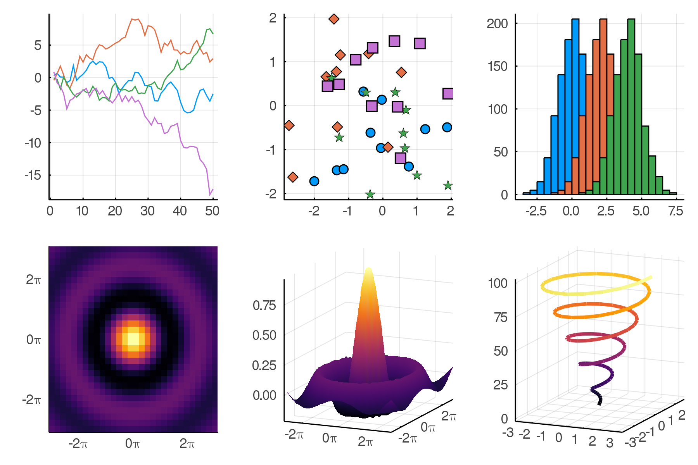

# PlotThemes

[](https://travis-ci.org/JuliaPlots/PlotThemes.jl)

#### Primary author: Patrick Kofod Mogensen (@pkofod)

PlotThemes is a package to spice up the plots made with [Plots.jl](https://github.com/tbreloff/Plots.jl). To install:

```julia
Pkg.add("PlotThemes")
```

## Using PlotThemes

Currently the following themes are available:
- `:default`
- `:dark`
- `:ggplot2`
- `:juno`
- `:lime`
- `:orange`
- `:sand`
- `:solarized`
- `:solarized_light`
- `:wong`
- `:wong2`
- `:gruvbox_dark`
- `:gruvbox_light`

When using Plots, a theme can be set using the `theme` function:
```julia
using Plots
theme(thm::Symbol; kwargs...)
```
`theme` accepts any Plots [attribute](http://docs.juliaplots.org/attributes/) as keyword argument and sets its value as default for subsequent plots.

Themes can be previewed using `Plots.showtheme(thm::Symbol)`:

### `:default`


### `:dark`


### `:ggplot2`


### `:juno`


### `:lime`


### `:orange`


### `:sand`


### `:solarized`


### `:solarized_light`


### `:wong`


### `:wong2`


### `:gruvbox_dark`


### `:gruvbox_light`


## Contributing
A theme specifies default values for different Plots [attributes](http://docs.juliaplots.org/attributes/).
At the moment these are typically colors, palettes and colorgradients, but any Plots attribute can be controlled by a theme in general.
PRs for new themes very welcome! Adding a new theme (e.g. `mytheme`) is as easy as adding a new file (mytheme.jl) that contains at least the following line:
```julia
_themes[:mytheme] = PlotTheme(; kwargs...)
```
The keyword arguments can be any collection of Plots attributes plus a colorgradient keyword argument.
When adding a new theme please also generate a `showtheme` image in `assets/` and add a corresponding entry to the README.
New `showtheme` images can be generated with `update_theme` in `assets/update_themes.jl`.
